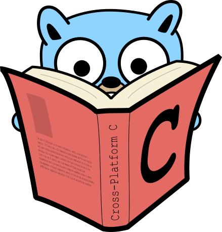

<!-- TITLE -->
<h1 align="center">BOOK MAN</h1>

  
  
  
  
  
  

<!-- BADGES -->

  
  
  
  

  

## Introduction
> `Bookman` is an online REST renting book platform.
>
> it's microservices and uses clean-architecture

### Ports
- `external` ports use HTTP-REST 
- `internal` ports use gRPC 

## Microservices:

- `User Service`
is user managment service

- `Auth Service`
is authentication service

- `Book Service`
will list all availables books

- `Rent Service`
is responsible for rent a book to a user

- `Notification Service`
contains email and other means notification

